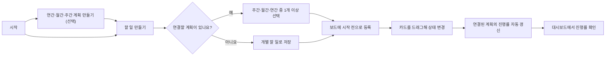
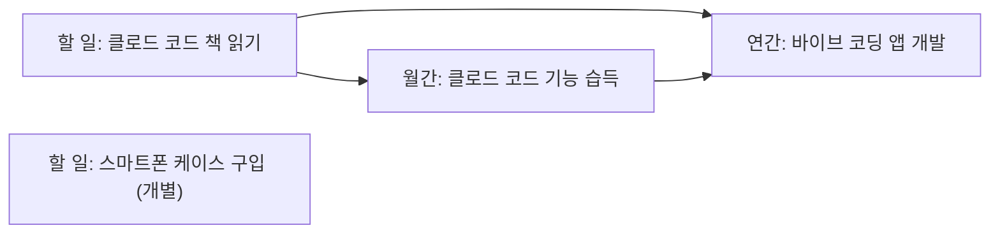
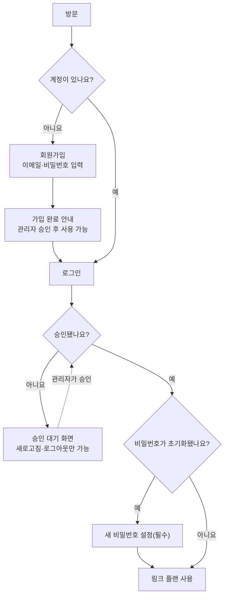
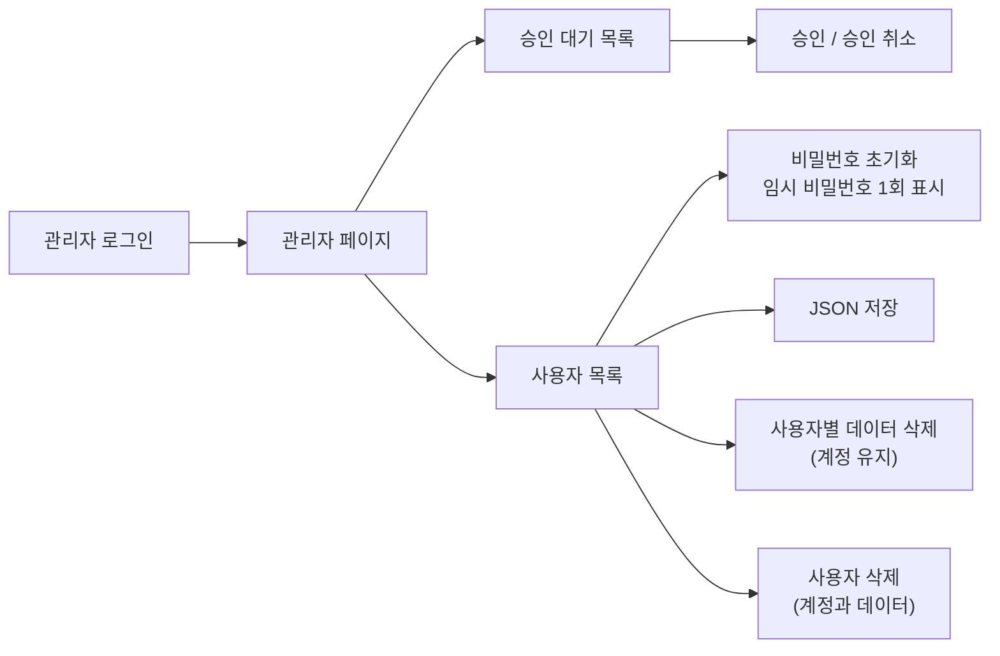
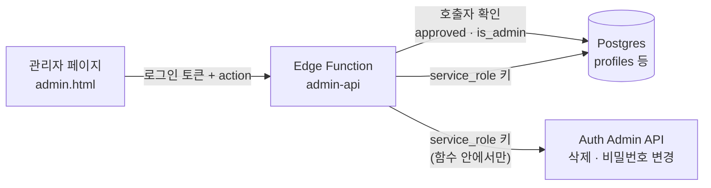
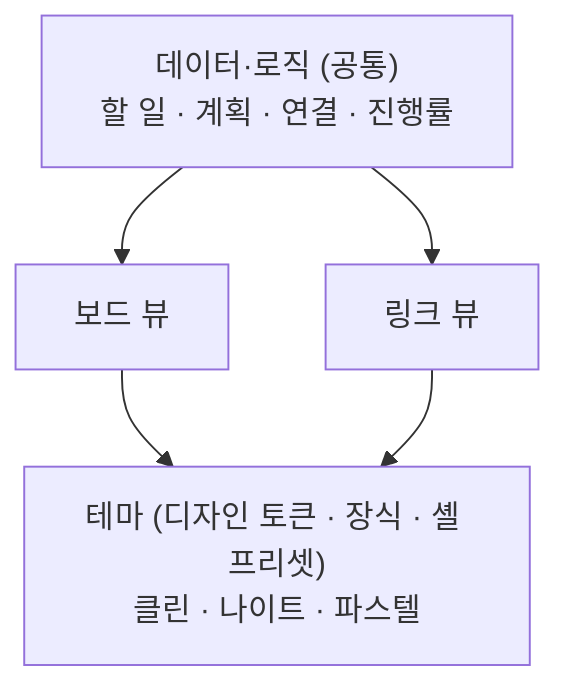

# 링크 플랜(Link Plan) PRD

Sep 26, 2026 · @포그니

링크 플랜(Link Plan)은 매일의 할 일을 주간·월간·연간 목표에 연결해, 지금 하는 일이 큰 목표에 얼마나 기여하는지 자동으로 보여 주는 할 일 관리 앱입니다.

## 1. Why - 목적

### 문제 정의

- 할 일 목록과 목표가 따로 관리되어, 일을 끝내도 목표에 얼마나 가까워졌는지 알 수 없습니다.
- 연간 목표를 세워도 월간·주간·일일 실행 계획으로 내려오지 않아 중간에 흐지부지됩니다.
- 모든 할 일을 목표에 억지로 묶으면 입력 부담이 커져 앱을 떠나게 됩니다. "스마트폰 케이스 구입" 같은 잡무는 개별적으로 둘 수 있어야 합니다.

### 제품 비전과 핵심 가치

- **연결**: 할 일 → 주간 계획 → 월간 계획 → 연간 목표의 4단계 구조로 실행과 목표를 잇습니다.
- **자동 반영**: 할 일의 상태가 바뀌면 연결된 주간·월간·연간 목표의 진행률이 자동으로 다시 계산됩니다.
- **선택적 연결**: 연결은 권장하되 강제하지 않습니다. 개별 할 일도 같은 화면과 같은 방식으로 관리합니다.

### 성공 지표

| 지표 | 정의 | 목표(제안값) |
| --- | --- | --- |
| 연결률 | 새로 만든 할 일 중 상위 계획에 1개 이상 연결된 비율 | 60% 이상 |
| 첫 주 계획 수립률 | 가입 후 7일 안에 주간 계획을 1개 이상 만든 사용자 비율 | 70% 이상 |
| 진행률 조회율 | 주 1회 이상 목표 진행률 화면을 본 활성 사용자 비율 | 70% 이상 |
| 4주 재방문율 | 가입 후 4주차에 다시 접속한 사용자 비율 | 40% 이상 |

목표 수치는 출시 전 가설이며, 베타 데이터를 보고 조정합니다.

## 2. Who - 타깃 사용자

핵심 타깃은 연간 목표를 세우고 꾸준히 실천하려는 개인 사용자입니다. 팀 협업과 공유는 이번 범위에서 제외합니다. 링크 플랜은 가입 후 관리자가 승인한 사용자만 쓸 수 있는 승인제 서비스입니다(4장 P0-14\~P0-16).

| 구분 | 페르소나 | 상황 | 핵심 니즈 |
| --- | --- | --- | --- |
| 주 타깃 | 자기계발형 직장인 | 올해 목표(예: 바이브 코딩 앱 개발)가 있지만, 퇴근 후 짧은 시간에 무엇을 할지 매번 고민합니다. | 오늘 한 일이 월간·연간 목표에 얼마나 기여했는지 확인하고 싶습니다. |
| 주 타깃 | 자격증·취업 준비생 | 시험이나 취업이라는 연간 목표를 월별 학습량과 주별 진도로 나누어야 합니다. | 목표를 월·주·일 단위로 쪼개고, 진도를 자동으로 확인하고 싶습니다. |
| 보조 타깃 | 프리랜서·1인 창작자 | 여러 프로젝트를 병행하며, 핵심 작업과 잡무가 한 목록에 섞여 있습니다. | 잡무는 개별 할 일로 두고, 핵심 작업만 목표와 연결하고 싶습니다. |

### 공통 사용 특성

- 혼자 사용하며, 하루에 한 번 이상 접속해 할 일을 확인합니다.
- 할 일 하나를 만드는 데 오래 걸리면 쓰지 않습니다. 연결은 빠르게 고를 수 있어야 합니다.
- 목표 관리 경험이 적은 사용자도 쓸 수 있어야 하므로, 처음에는 일일 할 일만 만들어도 사용할 수 있어야 합니다.

## 3. User Flow

사용자는 "계획 만들기 → 할 일 만들고 연결하기 → 보드에서 상태 바꾸기 → 진행률 확인하기"를 반복합니다. 계획이 없어도 할 일부터 만들 수 있습니다.

### 3-1. 전체 흐름



### 3-2. 단계별 상세

1. **계획 만들기(선택)**: 연간 목표를 만들고, 그 아래에 월간 계획과 주간 계획을 차례로 추가합니다. 각 계획은 자신의 상위 계획을 하나 고를 수 있습니다.
2. **할 일 만들기**: `+` 버튼을 눌러 제목(필수), 수행일과 메모(선택)를 입력합니다. 수행일이 있는 할 일은 일일 뷰에 나타납니다.
3. **연결 선택**: 저장하기 전에 연결 방식을 정해야 합니다.
   - 계획에 연결: 주간·월간·연간 계획 중 1개 이상을 고릅니다. 복수 선택이 가능합니다.
   - 개별 할 일: 연결 없이 저장합니다. 나중에 계획에 연결할 수도 있습니다.
4. **상태 변경**: 보드의 시작 전 / 진행 중 / 완료 열 사이에서 카드를 드래그하면 상태가 바뀝니다. 카드 메뉴로도 바꿀 수 있습니다.
5. **진행률 확인**: 대시보드에서 연간 → 월간 → 주간 순으로 진행률을 봅니다. 계획을 누르면 연결된 할 일 목록으로 이동합니다.
6. **수정·삭제**: 할 일과 계획은 언제든 수정·삭제할 수 있습니다. 계획을 삭제해도 연결된 할 일은 남고, 연결만 해제됩니다.

### 3-3. 연결 구조 예시



"클로드 코드 책 읽기"는 월간 계획과 연간 목표에 함께 연결되며, 연간 목표의 진행률에는 한 번만 집계됩니다. "스마트폰 케이스 구입"은 어디에도 연결되지 않은 개별 할 일입니다.

### 3-4 가입·로그인·승인 흐름



1. **회원가입**: 이메일과 비밀번호(영문·숫자를 각각 1자 이상 포함, 8자 이상)를 두 번 입력해 가입합니다. 가입이 끝나면 "관리자 승인 후 사용할 수 있습니다"라는 안내와 함께 로그인 화면으로 이동합니다(가입 직후 로그인된 상태가 되더라도 로그아웃 처리합니다).
2. **로그인**: 이메일과 비밀번호로 로그인합니다. 승인되지 않았으면 승인 대기 화면만 보이며, 여기서는 상태 새로고침과 로그아웃만 할 수 있습니다.
3. **승인 후 사용**: 관리자가 승인하면 상태를 새로고침하는 것만으로 앱이 열립니다.
4. **비밀번호 초기화 후 첫 로그인**: 관리자가 초기화한 계정은 로그인 직후 새 비밀번호를 정해야 앱을 쓸 수 있습니다.

### 3-5 관리자 흐름



1. 관리자는 일반 사용자와 같은 로그인 화면으로 들어가며, 앱 화면에서 관리자에게만 보이는 링크로 관리자 페이지에 갑니다.
2. 승인 대기 사용자가 목록 맨 위에 나옵니다. 승인 버튼을 누르면 그 사용자는 바로 앱을 쓸 수 있습니다.
3. 위험 작업(비밀번호 초기화, 데이터 삭제, 사용자 삭제)은 확인 창을 거칩니다. 삭제 작업은 대상 이메일을 직접 입력해야 실행됩니다.
4. 비밀번호를 초기화하면 임시 비밀번호가 한 번만 표시되므로, 관리자가 복사해 사용자에게 직접 전달합니다.
5. 데이터를 지우기 전에는 "JSON 저장"으로 먼저 내려받기를 권합니다.

## 4. 기능 요구 사항

P0는 할 일 관리, 상태 보드, 계획 연결, 진행률 자동 반영의 네 축과 계정·승인·관리자 기능이며, 모두 동작해야 출시할 수 있습니다. P1은 사용성을 높이는 기능으로 출시 후 순차적으로 추가합니다.

### P0 - 핵심 기능

| ID | 기능 | 요구 사항 | 인수 조건 |
| --- | --- | --- | --- |
| P0-1 | 할 일 생성 | 제목(필수, 100자 이내), 수행일과 메모(선택)를 입력해 만듭니다. 저장 전에 연결 방식(계획에 연결 / 개별 할 일)을 반드시 고릅니다. | 연결 방식을 고르지 않으면 저장할 수 없습니다. 저장된 할 일의 초기 상태는 시작 전입니다. |
| P0-2 | 할 일 수정·삭제 | 제목, 수행일, 메모, 연결을 수정하고 할 일을 삭제할 수 있습니다. | 삭제 전에 확인 창을 띄웁니다. 수정·삭제 직후 연결된 계획의 진행률이 다시 계산됩니다. |
| P0-3 | 상태 관리 | 할 일은 시작 전 / 진행 중 / 완료 중 하나의 상태만 가집니다. | 완료로 바꾸면 완료 시각을 기록하고, 다른 상태로 되돌리면 기록을 지웁니다. |
| P0-4 | 드래그 앤 드롭 상태 변경 | 보드의 세 열 사이에서 카드를 끌어다 놓아 상태를 바꿉니다. 마우스와 터치를 모두 지원합니다. | 놓는 즉시 화면에 반영합니다. 저장에 실패하면 카드를 원래 열로 되돌리고 오류를 알립니다. 카드 메뉴에서도 같은 변경이 가능해야 합니다. |
| P0-5 | 계획 CRUD | 연간 목표, 월간 계획, 주간 계획을 만들고 수정·삭제합니다. 각 계획은 제목과 기간(연/월/주)을 가집니다. | 계획을 삭제해도 연결된 할 일과 하위 계획은 남고, 연결만 해제됩니다. |
| P0-6 | 계획 간 연결 | 주간 계획은 월간 계획에, 월간 계획은 연간 목표에 연결합니다. 상위 계획은 최대 1개이며, 없어도 됩니다. | 주간 계획을 연간 목표에 바로 잇는 것처럼 단계를 건너뛰는 연결과 순환 연결은 막습니다. |
| P0-7 | 할 일-계획 연결 | 할 일을 주간·월간·연간 계획 중 0개 이상에 연결합니다. 0개이면 개별 할 일입니다. | "클로드 코드 책 읽기"를 월간·연간에 동시에 연결해 저장할 수 있고, "스마트폰 케이스 구입"을 개별 할 일로 저장할 수 있습니다. 저장 후에도 연결을 추가·해제할 수 있습니다. |
| P0-8 | 진행률 자동 반영 | 할 일의 상태, 연결, 삭제가 바뀌면 관련된 주간·월간·연간 진행률을 자동으로 다시 계산합니다. 계산 규칙은 아래 "진행률 계산 규칙"을 따릅니다. | 변경 후 1초 이내에 화면의 진행률이 갱신됩니다. 같은 할 일은 한 계획에서 한 번만 셉니다. |
| P0-9 | 기간별 뷰 | 일일 / 주간 / 월간 / 연간 뷰를 전환하며 해당 기간의 할 일과 계획을 봅니다. 일일 뷰는 수행일이 그날인 할 일을 보여 줍니다. | 수행일이 없는 할 일은 "기한 없음" 목록에서 볼 수 있습니다. 개별 할 일도 수행일 기준으로 뷰에 표시됩니다. |
| P0-10 | 진행률 대시보드 | 연간 → 월간 → 주간 순의 트리로 계획과 진행률(%)을 한눈에 보여 줍니다. | 계획을 누르면 연결된 할 일 목록으로 이동합니다. 할 일이 없는 계획은 0%가 아니라 "측정 전"으로 표시합니다. |
| P0-11 | 계정과 데이터 저장 | 로그인 후 데이터를 서버에 저장하고, 여러 기기에서 같은 내용을 봅니다. | 로그아웃 후 다시 로그인해도 모든 할 일, 계획, 연결이 그대로 유지됩니다. |
| P0-12 | 뷰 전환 | 보드 뷰와 링크 뷰를 전환합니다. 화면 폭이 1024px 미만이면 링크 뷰를 쓸 수 없고 보드 뷰로 전환합니다(6장). | 전환해도 데이터와 선택한 기간이 유지되며, 선택한 뷰는 새로고침 후에도 남습니다. |
| P0-13 | 테마 선택 | 클린, 나이트, 파스텔 중 하나를 골라 모든 화면에 즉시 적용합니다(6장). | 6개 조합(뷰 2종 × 테마 3종) 모두에서 P0 기능이 같은 방식으로 동작하고, 본문 글자 대비가 4.5:1 이상입니다. |
| P0-14 | 회원가입 | 이메일과 비밀번호(영문·숫자를 각각 1자 이상 포함, 8자 이상)를 입력해 가입하며, 비밀번호는 한 번 더 입력해 확인합니다. 가입한 사용자는 승인 대기 상태가 됩니다. | 규칙에 맞지 않는 비밀번호는 가입 전에 이유와 함께 화면에서 막고, 서버도 같은 규칙으로 거절합니다. 가입이 끝나면 "관리자 승인 후 사용할 수 있습니다" 안내를 보여 줍니다. |
| P0-15 | 로그인·로그아웃 | 이메일과 비밀번호로 로그인하고 로그아웃합니다. 승인되지 않은 사용자에게는 승인 대기 화면만 보여 줍니다. | 이메일이나 비밀번호가 틀리면 어느 쪽이 틀렸는지 알려 주지 않고 "이메일 또는 비밀번호가 올바르지 않습니다"만 보여 줍니다. 승인 대기 화면에는 상태 새로고침과 로그아웃만 있으며, 로그인 상태는 새로고침 후에도 유지됩니다. |
| P0-16 | 승인 기반 접근 제어 | 승인된 사용자만 자신의 데이터를 읽고 씁니다. 승인 여부는 서버(RLS)에서 검사합니다. | 화면을 거치지 않고 API를 직접 호출해도 미승인 사용자의 조회는 0행이고 저장은 실패합니다. 승인이 취소되면 로그인 토큰이 만료되기를 기다리지 않고 바로 차단됩니다. |
| P0-17 | 내 계정 | 로그인한 사용자가 비밀번호를 바꿉니다. 관리자가 초기화한 계정은 다음 로그인 때 새 비밀번호를 정해야 앱을 쓸 수 있습니다. | 새 비밀번호도 가입과 같은 규칙을 지키며, 초기화된 계정이 새 비밀번호를 정하기 전에는 앱 화면으로 넘어갈 수 없습니다. |
| P0-18 | 관리자 페이지·사용자 목록 | 관리자만 들어가는 별도 페이지에서 사용자 목록(이메일, 가입일, 상태)을 봅니다. 승인 대기 사용자를 맨 위에 보여 주고 이메일로 검색합니다. | 관리자가 아닌 계정이 주소로 들어오면 앱 화면으로 돌려보냅니다. 관리자 기능은 서버가 관리자 여부를 다시 확인하고, 관리자가 아니면 거절합니다. |
| P0-19 | 사용자 승인·승인 취소 | 관리자가 가입한 사용자를 승인하거나 승인을 취소합니다. | 승인할 때 승인 시각을 기록합니다. 관리자 계정의 승인은 취소할 수 없습니다. |
| P0-20 | 사용자 삭제 | 관리자가 사용자의 계정과 모든 데이터를 삭제합니다. | 대상 사용자의 이메일을 직접 입력해야 실행됩니다. 자기 자신과 다른 관리자 계정은 삭제할 수 없고, 삭제하면 할 일·계획·연결·설정이 함께 사라집니다. |
| P0-21 | 비밀번호 초기화 | 관리자가 사용자의 비밀번호를 임시 비밀번호(영문·숫자 12자)로 바꿉니다. 임시 비밀번호는 관리자 화면에 한 번만 보여 주고 복사할 수 있게 합니다. | 창을 닫으면 임시 비밀번호를 다시 볼 수 없고 서버에도 기록하지 않습니다. 자기 자신은 초기화할 수 없고 내 계정에서 바꿉니다. |
| P0-22 | 사용자 데이터 JSON 저장 | 관리자가 선택한 사용자의 프로필, 설정, 계획, 할 일, 연결을 JSON 파일로 내려받습니다(형식은 5-7). | 파일에 형식 이름, 버전, 저장 시각이 들어가고 비밀번호 같은 인증 정보는 들어가지 않습니다. 데이터가 없으면 빈 목록으로 저장합니다. |
| P0-23 | 사용자별 데이터 삭제 | 관리자가 선택한 사용자의 할 일·계획·연결·설정만 삭제하고 계정은 남깁니다. | 대상 이메일 입력으로 확인하며, 확인 창에서 JSON 저장을 먼저 권합니다. 중간에 실패하면 같은 작업을 다시 실행해 이어서 삭제할 수 있습니다. |

### P1 - 추가 기능

| ID | 기능 | 설명 |
| --- | --- | --- |
| P1-1 | 열 안 순서 변경 | 같은 열 안에서 카드를 끌어 우선순위 순서를 바꿉니다. |
| P1-2 | 연결 추천 | 새 할 일을 만들 때 이번 주 주간 계획과 최근에 쓴 계획을 위쪽에 추천합니다. |
| P1-3 | 미완료 이월 | 주가 끝나면 완료하지 못한 할 일을 다음 주 계획으로 한 번에 옮깁니다. |
| P1-4 | 반복 할 일 | 매일·매주 반복하는 할 일을 만들고, 반복할 때마다 새 카드를 자동으로 만듭니다. |
| P1-5 | 알림 | 수행일 당일 아침과 마감 임박 시점에 알려 줍니다. |
| P1-6 | 진행 중 가중치 | 진행 중인 할 일을 50%로 반영하는 옵션을 제공합니다. |
| P1-7 | 검색·필터 | 계획별, 상태별, 개별 할 일만 모아 보는 필터를 제공합니다. |
| P1-8 | 목표 회고 | 달성한 계획을 보관하고, 월말·연말에 완료 현황을 요약해 보여 줍니다. |
| P1-9 | 데이터 내보내기 | 할 일과 계획을 CSV로 내려받습니다. |
| P1-10 | 설정 계정 동기화 | 뷰와 테마 선택을 계정에 저장해 여러 기기에서 같게 씁니다. 테이블 user\_settings를 쓰며 RLS 규칙은 6-8을 따릅니다. |
| P1-11 | 시스템 다크 모드 연동 | 첫 방문 때 기기가 다크 모드이면 나이트 테마를 추천합니다. |
| P1-12 | 링크 뷰 대량 데이터 대응 | 선택한 기간의 계획만 표시하고, 선택한 노드의 연결선만 강조하며, 열을 접고 펼 수 있습니다. |
| P1-13 | 전체 사용자 JSON 저장 | 모든 사용자의 데이터를 사용자별 파일로 한 번에 내려받습니다. 함수 실행 시간 제한 때문에 사용자 1명씩 순서대로 호출합니다. 무료 플랜에는 자동 백업이 없어 백업 수단으로 우선순위를 높일 수 있습니다. |
| P1-14 | JSON 가져오기 | P0-22에서 저장한 파일을 같은 사용자나 새 사용자에게 복원합니다. 복원할 때 id를 새로 만들고 계획·할 일 사이의 연결을 유지합니다. |
| P1-15 | 관리자 작업 기록 | 승인, 삭제, 초기화, JSON 저장 같은 관리자 작업을 누가 언제 했는지 기록하고 관리자만 볼 수 있게 합니다. 임시 비밀번호는 기록하지 않습니다. |
| P1-16 | 가입 봇 방지 | 가입 화면에 CAPTCHA를 적용합니다(Supabase가 제공). 기본 가입·로그인 요청 한도는 IP당 5분에 30회입니다. |
| P1-17 | 이메일 비밀번호 재설정 | 사용자 지정 SMTP를 연결한 뒤, 사용자가 스스로 이메일로 비밀번호를 재설정합니다. 기본 이메일 발송은 시간당 2통으로 제한됩니다. |
| P1-18 | 관리자 권한 관리 화면 | 관리자 권한 부여·해제를 화면에서 합니다. 이번 범위에서는 SQL로만 바꿉니다(5-7). |

### 진행률 계산 규칙

계획(P)의 진행률은 P에 연결된 할 일 중 완료된 할 일의 비율입니다.

```latex
\text{진행률}(P) = \frac{\text{완료된 할 일 수}}{\text{P에 연결된 전체 할 일 수}} \times 100
```

1. **집계 대상**: P에 직접 연결된 할 일과, P의 하위 계획(연간 → 월간 → 주간 방향)에 연결된 할 일을 모두 셉니다. 같은 할 일이 여러 경로로 연결되어 있어도 한 번만 셉니다.
2. **상태 반영**: 완료만 진행률에 반영합니다. 시작 전과 진행 중은 0으로 계산합니다. 진행 중 가중치는 P1-6에서 다룹니다.
3. **할 일이 없는 계획**: 0%가 아니라 "측정 전"으로 표시합니다.
4. **표시 방식**: 소수점 첫째 자리에서 반올림한 정수(%)로 보여 줍니다.
5. **정합성**: 진행률은 서버에서 계산하며, 할 일의 상태·연결·삭제가 바뀔 때마다 관련된 모든 상위 계획에 다시 적용합니다.
6. **달성 표시**: 진행률이 100%가 되면 "달성" 배지를 보여 줍니다. 계획 자체를 자동으로 닫지는 않습니다.

계산 예시는 다음과 같습니다. 월간 계획 M에 할 일 A(완료)와 B(진행 중)가 연결되어 있으면 M의 진행률은 50%입니다. 연간 목표 Y에는 M이 연결되어 있고, A와 시작 전 상태인 C가 Y에도 직접 연결되어 있다고 하겠습니다. Y의 집계 대상은 중복을 제거한 A, B, C 세 건이므로 진행률은 33%입니다.

### 데이터 모델

| 엔티티 | 주요 필드 | 비고 |
| --- | --- | --- |
| 할 일(Task) | id, 제목, 메모, 수행일, 상태(시작 전/진행 중/완료), 완료 시각, 생성 시각 | 일일 단위는 별도 엔티티 없이 수행일로 표현합니다. |
| 계획(Plan) | id, 유형(주간/월간/연간), 제목, 시작일, 종료일, 상위 계획 id | 상위 계획은 주간→월간, 월간→연간만 허용하며 비어 있을 수 있습니다. |
| 할 일-계획 연결(TaskPlanLink) | 할 일 id, 계획 id | 다대다 관계입니다. 연결이 하나도 없는 할 일이 개별 할 일입니다. |

### 비기능 요구 사항

- **성능**: 상태 변경 후 진행률 갱신은 1초 이내, 보드에서 카드 500개까지 끊김 없이 드래그할 수 있어야 합니다.
- **접근성**: 드래그 앤 드롭으로 할 수 있는 모든 작업을 메뉴나 키보드로도 할 수 있어야 합니다.
- **데이터 안정성**: 삭제와 연결 해제는 다른 데이터를 지우지 않으며, 저장 실패 시 화면 상태를 서버 기준으로 되돌립니다.

### 가정과 열린 질문

- **가정**: 반응형 웹 앱(PC 우선, 모바일 대응)으로 만들고, 한국 표준시와 월요일 시작 주를 기준으로 합니다. 다르게 정하시면 알려 주세요.
- **가정(계정)**: 가입은 누구나 할 수 있지만 관리자가 승인한 사용자만 쓸 수 있습니다. 이메일 확인은 하지 않으며, 관리자 승인이 그 역할을 합니다(5-2).
- **범위 밖**: 팀 협업·공유, 외부 캘린더 연동은 이번 버전에서 다루지 않습니다.
- **열린 질문 1**: 한 주가 두 달에 걸칠 때 주간 계획을 어느 월간 계획에 연결할지는 현재 사용자가 직접 고르도록 했습니다. 자동 추천 규칙이 필요한지 정해야 합니다.
- **열린 질문 2**: 진행 중 가중치(P1-6)를 기본값으로 켤지, 옵션으로만 둘지 정해야 합니다.
- **열린 질문 3**: 비밀번호 규칙을 "영문과 숫자를 각각 1자 이상 포함, 8자 이상"으로 해석했고 특수문자도 허용합니다. 영문과 숫자만 허용해야 한다면 알려 주세요.
- **열린 질문 4**: 관리자는 1명(SQL로 지정)으로 시작합니다. 관리자 권한을 화면에서 부여·해제하는 기능은 P1-18로 미뤘습니다.
- **열린 질문 5**: 승인을 취소하거나 비밀번호를 초기화하면 데이터 접근은 즉시 막히지만, 이미 열려 있는 로그인 세션이 바로 끊기는지는 구현 단계에서 확인해야 합니다.

## 5. 기술 스택

링크 플랜은 빌드 도구 없는 Vanilla JS 정적 사이트를 GitHub Pages에 올리고, 이 앱 전용으로 새로 만드는 Supabase 프로젝트를 백엔드로 씁니다. 데이터 테이블 3개와 프로필 테이블, 진행률 뷰를 만들어 모두 RLS로 보호하고, 관리자 기능은 Edge Function 하나로 처리합니다.

### 5-1. 스택 구성

| 영역 | 선택 | 이유 |
| --- | --- | --- |
| 프론트엔드 | Vanilla JS(ES 모듈) + HTML/CSS, 빌드 도구 없음 | 정적 파일만으로 배포합니다. 화면 상태는 store 객체 하나에 두고, 보드·트리·진행률 렌더링을 파일별로 나눕니다. |
| 드래그 앤 드롭 | SortableJS 1.15.x (CDN) | 프레임워크 없이 쓸 수 있고, 목록 사이 이동과 터치 기기를 지원합니다. 키보드 조작은 라이브러리에 기대지 않고 P0-4의 카드 메뉴로 보장합니다. |
| 데이터 저장·인증 | Supabase 전용 프로젝트 (Postgres, Auth, Data API) | 링크 플랜만 쓰는 독립 프로젝트입니다. 사용자별 데이터 분리는 `auth.uid()` 기반 RLS로 처리합니다. |
| 클라이언트 | supabase-js v2 (jsDelivr CDN) | 공식 문서가 안내하는 CDN 설치 방식입니다. |
| 진행률 계산 | Postgres 뷰 `plan_progress` | 4장의 "중복 제거 후 완료 비율" 규칙을 SQL 한 곳에서 구현합니다. 뷰는 반드시 `security_invoker = true`로 만듭니다. |
| 화면 갱신 | 낙관적 업데이트 | 드롭 즉시 화면에 반영하고, 저장에 실패하면 되돌립니다(P0-4). |
| 호스팅 | GitHub Pages | 정적 호스팅이라 anon(publishable) 키가 브라우저에 그대로 노출됩니다. 방어선은 RLS와 테이블 권한(grant)입니다. |
| 뷰·테마 전환 | HTML 속성(`data-view`, `data-theme`)과 CSS 변수 | 6장 참고. 새로고침 없이 전환하고, 선택한 테마의 글꼴만 불러옵니다. |
| 관리자 기능 서버 | Supabase Edge Function admin-api (TypeScript) | 계정 삭제·비밀번호 변경은 service\_role 키가 필요해 브라우저에서 할 수 없습니다. 키는 함수 안에서만 씁니다(5-7). |
| 화면 구성 | index.html(앱, 로그인·가입·승인 대기 화면 포함)과 admin.html(관리자 페이지) | 같은 정적 사이트의 두 페이지입니다. 관리자 페이지의 접근 제한은 화면이 아니라 서버가 합니다(5-7). |

### 5-2 Supabase 프로젝트 운영 원칙

1. **전용 프로젝트**: 링크 플랜만 쓰는 새 Supabase 프로젝트를 만듭니다. 다른 앱과 테이블, 사용자, 로그인 세션을 나누지 않습니다. 나중에 다른 앱을 같은 프로젝트에 붙이게 되면 이 장의 규칙(이름, 권한, 인증 설정)을 다시 검토합니다.
2. **이름 규칙**: 테이블 이름에는 앱 접두사를 붙이지 않고 소문자 snake\_case로 짓습니다(`tasks`, `plans`). 다만 브라우저 `localStorage` 키에는 `linkplan_` 접두사를 유지합니다. GitHub Pages는 같은 주소 아래의 다른 앱과 브라우저 저장소를 나눠 쓰기 때문입니다.
3. **RLS 필수와 기본 권한 잠금**: 정적 사이트라 anon 키가 공개되므로 모든 테이블에 RLS를 켭니다. 새 객체에 anon·authenticated 권한이 자동으로 붙지 않도록 프로젝트 전체의 기본 권한을 처음에 한 번 잠그고(5-3의 0번 SQL), 이후에는 마이그레이션에서 필요한 권한만 명시적으로 부여합니다. 사용자 데이터 테이블의 정책에는 본인 행 조건과 함께 승인 조건이 들어갑니다(5-4).
4. **키 관리**: 브라우저 코드에는 anon(publishable) 키만 씁니다. service\_role·secret 키는 관리자 기능을 처리하는 Edge Function 안에서만 쓰고, 브라우저나 저장소에는 두지 않습니다(5-7).
5. **인증 설정**: 전용 프로젝트이므로 Site URL을 링크 플랜 주소로 바꾸고, Redirect URLs에는 같은 주소와 개발용 주소를 정확한 경로로 추가합니다(프로덕션에서는 와일드카드를 피합니다). 가입은 열어 두되 관리자가 승인하기 전에는 데이터에 접근하지 못하게 합니다. 이메일 확인(Confirm email)은 끕니다. 기본 이메일 발송이 시간당 2통(공식 문서 기준)으로 제한되어 인증 메일에 기대기 어렵고, 관리자 승인이 그 역할을 하기 때문입니다. 비밀번호 규칙(8자 이상, 영문·숫자 포함)은 Auth 설정(최소 길이 8, 필수 문자는 공식 문서의 "Digits and letters" 옵션)으로 서버에서 강제하고, 화면 검사는 사용자 안내에 씁니다. 가입·로그인 요청은 기본적으로 IP당 5분에 30회로 제한됩니다.
6. **관리자 기능**: 계정 삭제와 비밀번호 변경은 `service_role` 키가 필요한 서버 전용 API라 브라우저에서 할 수 없습니다. 그래서 관리자 작업은 Edge Function 하나(`admin-api`)로 처리합니다(5-7). 무료 플랜에서도 쓸 수 있으며, 함수 1회 실행은 메모리 256MB, CPU 시간 2초, 벽시계 시간 150초 안에서 끝나야 합니다.
7. **무료 플랜 조건**: 활성 프로젝트는 2개까지이므로 새 프로젝트를 만들기 전에 개수를 확인합니다. 프로젝트당 DB는 500MB, 월간 활성 사용자는 5만 명이며, 일주일 동안 DB 활동이 부족하면 자동으로 일시정지됩니다. 데이터는 유지되고 대시보드의 "Resume project"로 복구합니다(복구 가능 기간 1년). 다운로드할 수 있는 자동 백업은 없습니다. 다른 앱이 프로젝트를 깨워 주지 않으므로, 링크 플랜을 며칠 쓰지 않으면 정지될 수 있습니다.
8. **마이그레이션 관리**: 스키마 SQL은 저장소의 `supabase/migrations/` 폴더에, Edge Function 코드는 `supabase/functions/admin-api/`에 보관합니다. RLS 켜기와 권한 부여는 테이블 생성과 같은 파일에 넣습니다.

### 5-3. 테이블 설계와 생성 SQL

4장의 데이터 모델은 아래 객체로 구현합니다. 이름은 소문자 snake\_case이며 앱 접두사를 붙이지 않습니다(5-2).

| 4장 개념 | 실제 객체 | 설명 |
| --- | --- | --- |
| 할 일 | `tasks` | 제목, 메모, 수행일, 상태, 완료 시각을 가집니다. |
| 계획(주간·월간·연간) | `plans` | 유형, 기간, 상위 계획(`parent_id`)을 가집니다. |
| 할 일-계획 연결 | `task_plan_links` | 다대다 연결입니다. 연결 행이 없는 할 일이 개별 할 일입니다. |
| 진행률 | `plan_progress` (뷰) | 계획별 전체·완료 할 일 수를 중복 없이 집계합니다. |
| 상태·유형 | `task_status`, `plan_type` (enum) | 시작 전(todo) / 진행 중(doing) / 완료(done), 주간 / 월간 / 연간 |
| 상위 계획 규칙 | `check_plan_parent` (트리거 함수) | 주간→월간, 월간→연간 연결만 허용하고, 하위 계획이 있는 계획의 유형 변경을 막습니다. |
| 사용자 프로필 | `profiles` | 가입한 사용자마다 1행입니다. 이메일, 승인 여부, 관리자 여부, 가입·승인 시각을 가지며, 클라이언트는 자기 행을 읽기만 합니다. |
| 프로필 자동 생성 | `private.handle_new_user` (트리거 함수) | 가입 직후 `profiles` 행을 만듭니다(승인은 꺼진 상태). |
| 승인 확인 | `private.is_approved()` (함수) | RLS 정책이 쓰는 승인 여부 확인 함수입니다. |

데이터 테이블 세 개(\`plans\`, \`tasks\`, \`task\_plan\_links\`)는 모두 `user_id`를 가지며, 기본값이 `auth.uid()`라서 앱이 직접 넣지 않아도 됩니다. 연결 테이블은 `(id, user_id)` 복합 외래 키로 할 일과 계획을 참조합니다. 다른 사용자의 계획 id를 알아도 내 할 일과 연결할 수 없습니다. 아래 SQL은 5-4의 RLS SQL과 같은 마이그레이션으로 함께 실행합니다.

아래 SQL은 새 프로젝트의 SQL Editor에서 위에서부터 순서대로 실행합니다. 0번(기본 권한 잠그기)은 프로젝트 전체에 적용되므로 테이블을 만들기 전에 한 번만 실행합니다.

```sql
-- 0) 기본 권한 잠그기 (프로젝트 전체에 적용, 테이블을 만들기 전에 한 번만 실행)
alter default privileges for role postgres in schema public
  revoke select, insert, update, delete on tables from anon, authenticated;
alter default privileges for role postgres in schema public
  revoke execute on functions from anon, authenticated;
alter default privileges for role postgres in schema public
  revoke usage, select on sequences from anon, authenticated;
alter default privileges for role postgres in schema public
  revoke execute on functions from public;

-- 1) enum 타입
create type public.task_status as enum ('todo', 'doing', 'done');
create type public.plan_type as enum ('weekly', 'monthly', 'yearly');

-- 2) 계획 (주간·월간·연간)
create table public.plans (
  id uuid primary key default gen_random_uuid(),
  user_id uuid not null default auth.uid() references auth.users (id) on delete cascade,
  plan_type public.plan_type not null,
  title text not null check (char_length(title) between 1 and 100),
  period_start date not null,
  period_end date not null,
  parent_id uuid,
  created_at timestamptz not null default now(),
  check (period_end >= period_start),
  unique (id, user_id),
  foreign key (parent_id, user_id) references public.plans (id, user_id)
    on delete set null (parent_id)
);

-- 3) 할 일
create table public.tasks (
  id uuid primary key default gen_random_uuid(),
  user_id uuid not null default auth.uid() references auth.users (id) on delete cascade,
  title text not null check (char_length(title) between 1 and 100),
  memo text,
  due_date date,
  status public.task_status not null default 'todo',
  completed_at timestamptz,
  created_at timestamptz not null default now(),
  unique (id, user_id)
);

-- 4) 할 일-계획 연결 (연결이 하나도 없는 할 일 = 개별 할 일)
create table public.task_plan_links (
  task_id uuid not null,
  plan_id uuid not null,
  user_id uuid not null default auth.uid(),
  primary key (task_id, plan_id),
  foreign key (task_id, user_id) references public.tasks (id, user_id) on delete cascade,
  foreign key (plan_id, user_id) references public.plans (id, user_id) on delete cascade
);

-- 5) RLS 정책이 쓰는 열과 조인 열에 인덱스
create index plans_user_id_idx on public.plans (user_id);
create index plans_parent_id_idx on public.plans (parent_id);
create index tasks_user_id_idx on public.tasks (user_id);
create index task_plan_links_user_id_idx on public.task_plan_links (user_id);
create index task_plan_links_plan_id_idx on public.task_plan_links (plan_id);

-- 6) 상위 계획 규칙: 주간→월간, 월간→연간만 허용, 하위 계획이 있으면 유형 변경 금지
create function public.check_plan_parent()
returns trigger
language plpgsql
set search_path = ''
as $$
declare
  parent_type public.plan_type;
begin
  if tg_op = 'UPDATE' and new.plan_type is distinct from old.plan_type then
    if exists (select 1 from public.plans where parent_id = new.id) then
      raise exception '하위 계획이 있는 계획은 유형을 바꿀 수 없습니다.';
    end if;
  end if;

  if new.parent_id is null then
    return new;
  end if;

  select p.plan_type into parent_type from public.plans p where p.id = new.parent_id;
  if parent_type is null
     or not ((new.plan_type = 'weekly' and parent_type = 'monthly')
          or (new.plan_type = 'monthly' and parent_type = 'yearly')) then
    raise exception '허용되지 않는 상위 계획 유형입니다.';
  end if;
  return new;
end;
$$;

revoke execute on function public.check_plan_parent() from public, anon, authenticated;

create trigger plans_check_parent
before insert or update of parent_id, plan_type on public.plans
for each row execute function public.check_plan_parent();
```

`on delete set null (parent_id)`는 Postgres 15 이상에서 쓸 수 있습니다. 계획을 삭제하면 하위 계획의 `parent_id`만 비워지고, 할 일은 남습니다(P0-5). 연결 행은 계획이나 할 일이 삭제될 때 함께 지워집니다.

트리거 함수 `check_plan_parent`는 세 가지를 막습니다. 상위 계획의 유형이 규칙(주간→월간, 월간→연간)에 맞지 않는 연결, 상위 계획을 찾지 못하는 연결, 하위 계획이 있는 계획의 유형 변경(예: 주간 계획을 거느린 월간 계획을 연간으로 바꾸는 경우)입니다.

계정·승인 기능(P0-14\~P0-23)에 필요한 프로필과 승인 확인 함수는 아래 SQL로 만듭니다. 5-4의 RLS 정책이 `private.is_approved()`를 쓰므로 반드시 5-4보다 먼저 실행합니다.

```sql
-- 7) 프로필과 승인 확인 (5-4의 RLS 정책보다 먼저 실행)
create schema if not exists private;

create table public.profiles (
  id uuid primary key references auth.users (id) on delete cascade,
  email text not null,
  approved boolean not null default false,
  is_admin boolean not null default false,
  created_at timestamptz not null default now(),
  approved_at timestamptz
);

-- 가입하면 프로필을 자동으로 만든다 (승인과 관리자 권한은 꺼진 상태)
create function private.handle_new_user()
returns trigger
language plpgsql
security definer
set search_path = ''
as $$
begin
  insert into public.profiles (id, email)
  values (new.id, new.email);
  return new;
end;
$$;

create trigger on_auth_user_created
after insert on auth.users
for each row execute function private.handle_new_user();

-- RLS 정책이 쓰는 승인 확인 함수
create function private.is_approved()
returns boolean
language sql
security definer
stable
set search_path = ''
as $$
  select coalesce(
    (select p.approved from public.profiles p where p.id = (select auth.uid())),
    false
  );
$$;

revoke execute on function private.is_approved() from public;
grant usage on schema private to authenticated;
grant execute on function private.is_approved() to authenticated;
```

프로필은 가입 직후 트리거가 자동으로 만들며, `approved`와 `is_admin`은 꺼진 상태로 시작합니다. 이메일은 가입할 때의 값을 복사해 두며, 이번 버전에는 이메일 변경 기능이 없습니다. `private` 스키마는 Data API에 노출하지 않는 스키마이므로 트리거 함수와 승인 확인 함수를 여기에 둡니다. `is_approved()`를 `security definer`로 만든 것은 `profiles`의 RLS 정책과 서로 얽히지 않게 하기 위해서이고, `search_path`를 비워 모든 이름을 스키마와 함께 씁니다. `profiles`는 `auth.users`의 기본 키(`id`)만 참조합니다. Supabase가 관리하는 다른 열에는 의존하지 않기 위해서입니다. 공식 문서의 경고대로 이 트리거가 실패하면 가입이 막히므로 5-6에서 가입 테스트를 합니다.

### 5-4. RLS·권한·진행률 뷰 SQL

사용자 데이터 테이블(`plans`, `tasks`, `task_plan_links`)은 본인 행이면서 승인된 사용자일 때만 다룰 수 있게 합니다. 정책은 작업(select, insert, update, delete)마다 하나씩 만들고 모두 `to authenticated`로 제한합니다. 승인 확인은 `(select private.is_approved())` 형태로 감싸 쿼리마다 한 번만 계산되게 합니다. `profiles`는 자기 행을 읽기만 할 수 있고 쓰기 권한과 정책을 두지 않으므로, `approved`와 `is_admin` 값은 클라이언트가 바꿀 수 없고 서버(Edge Function)와 SQL Editor에서만 바뀝니다. 연결 테이블은 수정할 일이 없으므로 update 권한과 정책을 두지 않습니다. 5-3의 0번 SQL로 기본 권한을 이미 잠갔더라도 아래의 revoke와 grant는 마이그레이션에 그대로 적어 둡니다. 나중에 프로젝트 설정이 바뀌어도 결과가 같게 하기 위해서입니다.

```sql
-- 1) RLS 켜기
alter table public.plans enable row level security;
alter table public.tasks enable row level security;
alter table public.task_plan_links enable row level security;
alter table public.profiles enable row level security;

-- 2) client 역할의 권한을 회수하고, authenticated에게 필요한 권한만 부여 (anon은 권한 없음)
revoke all on table
  public.plans, public.tasks, public.task_plan_links, public.profiles
  from anon, authenticated;

grant select, insert, update, delete on table
  public.plans, public.tasks to authenticated;
grant select, insert, delete on table
  public.task_plan_links to authenticated;
grant select on table public.profiles to authenticated;

-- 3) plans 정책: 본인 행이고 승인된 사용자일 때만
create policy plans_select_own on public.plans
  for select to authenticated
  using ((select auth.uid()) = user_id and (select private.is_approved()));
create policy plans_insert_own on public.plans
  for insert to authenticated
  with check ((select auth.uid()) = user_id and (select private.is_approved()));
create policy plans_update_own on public.plans
  for update to authenticated
  using ((select auth.uid()) = user_id and (select private.is_approved()))
  with check ((select auth.uid()) = user_id and (select private.is_approved()));
create policy plans_delete_own on public.plans
  for delete to authenticated
  using ((select auth.uid()) = user_id and (select private.is_approved()));

-- 4) tasks 정책
create policy tasks_select_own on public.tasks
  for select to authenticated
  using ((select auth.uid()) = user_id and (select private.is_approved()));
create policy tasks_insert_own on public.tasks
  for insert to authenticated
  with check ((select auth.uid()) = user_id and (select private.is_approved()));
create policy tasks_update_own on public.tasks
  for update to authenticated
  using ((select auth.uid()) = user_id and (select private.is_approved()))
  with check ((select auth.uid()) = user_id and (select private.is_approved()));
create policy tasks_delete_own on public.tasks
  for delete to authenticated
  using ((select auth.uid()) = user_id and (select private.is_approved()));

-- 5) task_plan_links 정책 (select, insert, delete만)
create policy links_select_own on public.task_plan_links
  for select to authenticated
  using ((select auth.uid()) = user_id and (select private.is_approved()));
create policy links_insert_own on public.task_plan_links
  for insert to authenticated
  with check ((select auth.uid()) = user_id and (select private.is_approved()));
create policy links_delete_own on public.task_plan_links
  for delete to authenticated
  using ((select auth.uid()) = user_id and (select private.is_approved()));

-- 6) profiles 정책: 자기 행 읽기만 (쓰기 정책 없음)
create policy profiles_select_own on public.profiles
  for select to authenticated using ((select auth.uid()) = id);

-- 7) 진행률 뷰: security_invoker로 위 RLS(승인 조건 포함)를 그대로 따르게 함
create view public.plan_progress
with (security_invoker = true) as
with tree as (
  select id as plan_id, id as member_id from public.plans          -- 자기 자신
  union all
  select parent_id, id from public.plans where parent_id is not null  -- 하위 계획
  union all
  select g.parent_id, p.id                                             -- 하위의 하위 계획
  from public.plans p
  join public.plans g on g.id = p.parent_id
  where g.parent_id is not null
)
select
  t.plan_id,
  count(distinct l.task_id) as total_tasks,
  count(distinct l.task_id) filter (where k.status = 'done') as done_tasks
from tree t
left join public.task_plan_links l on l.plan_id = t.member_id
left join public.tasks k on k.id = l.task_id
group by t.plan_id;

revoke all on table public.plan_progress from anon, authenticated;
grant select on table public.plan_progress to authenticated;
```

뷰는 같은 할 일이 여러 경로로 연결되어도 `count(distinct)`로 한 번만 셉니다. 진행률(%)은 앱에서 `done_tasks / total_tasks`로 계산하고, `total_tasks`가 0이면 "측정 전"으로 표시합니다(4장 규칙).

### 5-5. RLS 검증 체크리스트

배포 전에 승인된 사용자 A·B, 승인 전 사용자 C, 관리자 계정으로 아래를 모두 확인합니다. 하나라도 실패하면 배포하지 않습니다.

| 번호 | 시나리오 | 기대 결과 |
| --- | --- | --- |
| 1 | 로그인 없이 anon 키로 네 테이블과 뷰를 조회 | 권한 오류(42501)가 나며 데이터가 보이지 않습니다. |
| 2 | A가 로그인해 자신의 할 일·계획·연결을 만들고 수정·삭제 | 모두 성공합니다. |
| 3 | B가 A의 할 일·계획·연결을 조회 | 0행이 반환됩니다. |
| 4 | B가 A의 행을 수정·삭제 | 오류 없이 0행에만 적용되고, A의 데이터는 그대로입니다. |
| 5 | B가 `user_id`를 A의 id로 넣어 새 행을 저장 | 정책 위반으로 저장에 실패합니다. |
| 6 | B가 A의 계획 id로 자기 할 일을 연결 | 외래 키 오류로 실패합니다. |
| 7 | 주간 계획을 연간 목표에 바로 연결 | 트리거 예외로 실패합니다. |
| 8 | B가 진행률 뷰를 조회 | B의 데이터만 집계됩니다. |
| 9 | 하위 주간 계획이 있는 월간 계획의 유형을 연간으로 변경 | 트리거 예외로 실패하고, 계획은 그대로입니다. |
| 10 | 트랜잭션 안에서 grant 없이 임시 테이블을 만들고 anon·authenticated로 조회(끝나면 rollback) | 권한 오류(42501)가 나며, 기본 권한 잠금이 적용된 것을 확인합니다. |
| 11 | 대시보드의 Advisors(보안 점검) 실행 | RLS 관련 경고가 없습니다. |
| 12 | 승인 전 사용자(C)가 할 일·계획·연결을 조회하거나 저장 | 조회는 0행이고 저장은 정책 위반으로 실패합니다. |
| 13 | 일반 사용자가 profiles에서 다른 사용자의 행을 조회 | 0행이 반환됩니다. |
| 14 | 일반 사용자가 profiles의 approved·is\_admin을 수정하거나 행을 추가·삭제 | 권한 오류(42501)로 실패합니다. |
| 15 | 승인을 취소(approved = false)한 직후, 같은 로그인 세션으로 데이터를 조회 | 토큰 만료를 기다리지 않고 즉시 0행이 반환됩니다. |
| 16 | 관리자 API를 토큰 없이, anon 키만으로, 일반 사용자 토큰으로 호출 | 401 또는 403으로 거절됩니다. |
| 17 | 관리자 API로 자기 자신 삭제, 관리자 계정 삭제·승인 취소, 자기 비밀번호 초기화를 시도 | 모두 거절됩니다. |
| 18 | 새 계정으로 가입 | profiles 행이 자동으로 1개 생기고 approved와 is\_admin이 모두 꺼져 있습니다. |
| 19 | 7자 비밀번호, 영문만 있는 비밀번호, 숫자만 있는 비밀번호로 가입 | 가입이 거절됩니다. |

번호 3\~10과 12\~15는 SQL Editor에서 `set local role authenticated`와 `set local request.jwt.claim.sub = '<사용자 id>'`로 사용자를 바꿔 가며 확인할 수 있습니다. 번호 10은 `begin`으로 시작해 임시 테이블을 만든 뒤 `rollback`으로 지웁니다. 번호 16\~17은 HTTP 요청이나 관리자 페이지로, 번호 18\~19는 앱 화면에서 확인합니다. Supabase CLI를 쓴다면 pgTAP(`supabase test db`)으로 SQL 시나리오를 자동화할 수 있습니다.

### 5-6. 배포·설정 체크리스트

- [ ] 새 Supabase 프로젝트를 만듭니다. 무료 플랜이면 활성 프로젝트가 2개 미만인지 먼저 확인하고, 지역은 사용자와 가까운 곳(예: 서울)을 고릅니다. DB 비밀번호는 비밀번호 관리자에 보관합니다.
- [ ] Postgres 버전이 15 이상인지 확인합니다. `security_invoker` 뷰와 `on delete set null (parent_id)`가 필요합니다.
- [ ] 5-3의 0번 SQL로 기본 권한을 잠그고, 대시보드의 Data API 설정에서 "Default privileges for new entities"가 꺼져 있는지 확인합니다.
- [ ] 5-3, 5-4 SQL(프로필과 승인 함수 포함)을 마이그레이션 파일(`supabase/migrations/`)로 저장하고 SQL Editor에서 순서대로 실행합니다.
- [ ] Database > Policies에서 `profiles`를 포함한 모든 테이블의 RLS가 켜져 있는지 확인합니다.
- [ ] Authentication > URL Configuration에서 Site URL을 링크 플랜 주소로 바꾸고, Redirect URLs에 같은 주소와 개발용 주소를 정확한 경로로 추가합니다.
- [ ] Authentication에서 이메일·비밀번호 로그인을 켜고 "Confirm email"을 끕니다(관리자 승인이 대신함). "Allow new users to sign up"은 켜 둡니다.
- [ ] 비밀번호 규칙을 설정합니다. 최소 길이는 8로 하고, 필수 문자는 숫자와 영문자를 함께 요구하는 옵션(공식 문서의 "Digits and letters")을 고릅니다. 이 설정은 가입과 비밀번호 변경에 모두 적용됩니다. 규칙은 사용자가 생기기 전에 정합니다. 나중에 강화하면 약한 비밀번호를 쓰던 기존 사용자는 로그인할 때 오류를 받습니다(공식 문서).
- [ ] 가입 테스트를 합니다. 새 계정으로 가입해 `profiles` 행이 생기는지 확인합니다. 트리거가 실패하면 가입이 막힐 수 있습니다.
- [ ] 관리자로 쓸 계정으로 가입한 뒤 5-7의 SQL로 첫 관리자를 지정합니다.
- [ ] Edge Function `admin-api`를 배포하고, 시크릿 `ALLOWED_ORIGIN`을 링크 플랜 주소로 설정하고, `verify_jwt`가 켜져 있는지 확인합니다.
- [ ] 브라우저 설정 파일에는 프로젝트 URL과 anon(publishable) 키만 넣습니다.
- [ ] 5-5 체크리스트를 통과한 뒤 GitHub Pages에 배포합니다.
- [ ] 백업 대책을 정합니다. 무료 플랜은 다운로드할 수 있는 자동 백업이 없으므로, 관리자 JSON 저장(P0-22)을 정기적으로 하거나 P1-13(전체 사용자 JSON 저장)과 `pg_dump`를 검토합니다.
- [ ] 일시정지 대책을 정합니다. 일주일 넘게 쓰지 않으면 프로젝트가 멈출 수 있으므로 복구 방법("Resume project")을 README에 적어 둡니다. 계속 서비스할 계획이면 Pro 플랜 전환을 검토합니다.

### 5-7 관리자 기능 구조와 API

관리자 기능 중 계정 삭제와 비밀번호 변경은 `service_role` 키가 필요한 서버 전용 API이며, 이 키는 브라우저에 둘 수 없습니다(공식 문서). 그래서 관리자 작업은 모두 Supabase Edge Function 하나(`admin-api`)를 거칩니다. 관리자 페이지는 로그인한 관리자의 토큰과 작업 이름(action)만 보내고, 함수가 서버에서 관리자 여부를 다시 확인한 뒤 실행합니다. 이렇게 하면 일반 사용자용 RLS에 관리자 예외 정책을 넣지 않아도 됩니다.



**공통 규칙**

1. 함수는 기본 설정대로 로그인 토큰(JWT)을 검증합니다(`verify_jwt`를 끄지 않습니다).
2. 함수 안에서 토큰의 사용자 id로 `profiles`를 조회해 `approved`와 `is_admin`이 모두 참인지 확인하고, 아니면 403을 돌려줍니다.
3. `service_role` 키는 함수에 기본으로 제공되는 환경 변수로만 읽고, 응답·로그·저장소에 남기지 않습니다.
4. CORS는 링크 플랜 주소(시크릿 `ALLOWED_ORIGIN`)만 허용하고 OPTIONS 요청에 응답합니다.
5. action은 허용 목록에 있는 것만 처리하고, `user_id`는 UUID 형식인지 검사합니다.
6. 자기 자신이나 관리자 계정에 대한 위험 작업은 아래 표대로 거절합니다.
7. 함수 1회 실행은 사용자 1명 단위로 처리해 무료 플랜의 실행 제한(메모리 256MB, CPU 2초, 벽시계 150초) 안에 끝나게 합니다.

**작업 목록**

| action | 입력 | 동작 | 안전장치 | 요구 사항 |
| --- | --- | --- | --- | --- |
| `list_users` | 없음 | 모든 사용자의 이메일, 승인 여부, 관리자 여부, 가입일, 승인일을 돌려줍니다. | 관리자만 호출 | P0-18 |
| `set_approved` | `user_id`, `approved` | 승인 여부를 바꾸고 승인 시각을 기록합니다(취소하면 비웁니다). | 관리자 계정의 승인은 취소할 수 없음 | P0-19 |
| `delete_user` | `user_id`, `confirm_email` | Auth 사용자를 완전히 삭제합니다(소프트 삭제 아님). 프로필과 모든 데이터가 외래 키 연쇄로 함께 삭제됩니다. | 확인 이메일이 대상과 같아야 하고, 자기 자신·관리자 계정은 삭제 불가 | P0-20 |
| `reset_password` | `user_id` | 임시 비밀번호(영문·숫자 12자, 영문과 숫자를 각각 1자 이상 포함)를 만들어 비밀번호를 바꾸고, 사용자 정보에 `must_change_password: true`를 남깁니다. 임시 비밀번호는 이 응답에만 담습니다. | 자기 자신은 불가, 비밀번호를 기록하지 않음 | P0-21 |
| `export_user` | `user_id` | 사용자의 프로필, 설정, 계획, 할 일, 연결을 읽어 아래 형식의 JSON으로 돌려줍니다. 관리자 페이지가 파일로 저장합니다. | 인증 정보는 포함하지 않음 | P0-22 |
| `delete_user_data` | `user_id`, `confirm_email` | 할 일과 계획(연결은 함께 삭제)과 설정을 삭제합니다. 계정과 프로필은 남깁니다. | 확인 이메일 필수, 다시 실행해도 결과가 같음 | P0-23 |

**비밀번호 초기화 후 화면 규칙**

초기화된 계정은 로그인 직후 사용자 정보의 `must_change_password`가 참이면 새 비밀번호 화면으로 보내고, 새 비밀번호를 정할 때 `updateUser({ password, data: { must_change_password: false } })`로 비밀번호와 이 값을 한 번에 바꿉니다. 이 값은 사용자가 스스로 바꿀 수 있어 보안 경계가 아닙니다. 임시 비밀번호를 그대로 쓰지 않게 하는 화면 규칙일 뿐이며, RLS와 관리자 API는 이 값을 믿지 않습니다.

**JSON 저장 형식(P0-22)**

```json
{
  "format": "linkplan-export",
  "version": 1,
  "exported_at": "2026-09-27T00:00:00Z",
  "profile": { "id": "...", "email": "user@example.com", "approved": true, "created_at": "...", "approved_at": "..." },
  "settings": { "theme": "clean", "view_mode": "board" },
  "plans": [
    { "id": "...", "plan_type": "weekly", "title": "...", "period_start": "2026-09-21", "period_end": "2026-09-27", "parent_id": null, "created_at": "..." }
  ],
  "tasks": [
    { "id": "...", "title": "...", "memo": null, "due_date": "2026-09-26", "status": "doing", "completed_at": null, "created_at": "..." }
  ],
  "task_plan_links": [ { "task_id": "...", "plan_id": "..." } ]
}
```

파일 이름은 `링크플랜_<이메일 앞부분>_YYYYMMDD.json`입니다. 설정 테이블(P1-10)이 없는 동안 `settings`는 `null`입니다.

**첫 관리자 지정**

관리자로 쓸 계정으로 먼저 가입한 뒤 SQL Editor에서 아래를 실행합니다.

```sql
update public.profiles
set approved = true, approved_at = now(), is_admin = true
where email = '관리자 이메일';
```

관리자 권한은 화면에서 바꾸지 않고 SQL로만 바꿉니다(P1-18로 미룸). 마지막 관리자를 잃지 않도록 관리자 계정을 지우거나 강등하기 전에 다른 관리자를 만들어 둡니다.

**알려진 한계**

- 승인 취소는 RLS로 데이터 접근을 즉시 막지만, 이미 열려 있는 로그인 세션 자체가 바로 끊기는지는 구현 단계에서 확인합니다. 비밀번호 초기화 뒤의 기존 세션도 같습니다.
- 이메일 확인을 하지 않으므로 다른 사람의 이메일로 가입할 수 있습니다. 관리자가 아는 사람만 승인하는 것으로 막습니다.
- 관리자 계정이 탈취되면 모든 사용자 데이터를 볼 수 있습니다. 관리자 비밀번호는 다른 곳과 겹치지 않게 관리하고, 필요하면 관리자 작업 기록(P1-15)을 추가합니다.

## 6. 뷰·테마 구조

링크 플랜은 데이터와 기능을 하나로 두고, 화면 표현만 뷰 2종 × 테마 3종으로 나눕니다. 사용자는 뷰와 테마를 따로 고르며, 6개 조합 모두에서 P0 기능이 같은 방식으로 동작해야 합니다.

### 6-1 구조와 조합

- **뷰**는 화면의 구성 방식입니다. 보드 뷰와 링크 뷰가 있습니다.
- **테마**는 색, 글꼴, 모양, 장식, 셸 배치입니다. 클린, 나이트, 파스텔이 있습니다.
- **데이터·로직**(할 일, 계획, 연결, 진행률, 상태 변경)은 뷰와 테마에 상관없이 하나입니다.



| 뷰 \\ 테마 | 클린 (라이트) | 나이트 (다크) | 파스텔 (라이트) |
| --- | --- | --- | --- |
| 보드 뷰 | 클린 · 보드 뷰 | 나이트 · 보드 뷰 | 파스텔 · 보드 뷰 |
| 링크 뷰 | 클린 · 링크 뷰 | 나이트 · 링크 뷰 | 파스텔 · 링크 뷰 |

표의 이름은 디자인 시안 캔버스의 시안 이름과 같습니다. 이 구조에 필요한 요구 사항 P0-12, P0-13, P1-10\~P1-12는 4장의 표에 추가했습니다.

### 6-2 뷰 정의

두 뷰는 같은 데이터를 다르게 보여 줍니다. 아래 표는 P0 기능이 각 뷰에서 어떻게 나타나는지 정리한 것입니다.

| 항목 | 보드 뷰 | 링크 뷰 |
| --- | --- | --- |
| 화면 구성 | 시작 전 / 진행 중 / 완료 3열 칸반과, 위쪽의 목표 연결 요약 | 연간 → 월간 → 주간 → 할 일 4열 노드 그래프, 아래쪽 상태 트레이, 오른쪽 아래 개별 할 일 구역 |
| 상태 변경 (P0-4) | 카드를 열 사이로 끌기 | 카드를 상태 트레이로 끌기 |
| 연결 확인 (P0-7) | 카드의 연결 칩 | 노드 사이의 연결선 |
| 연결 만들기·해제 | 새 할 일 패널, 상세 패널 | 새 할 일 패널, 상세 패널, 노드의 점을 끌어 잇기 |
| 진행률 (P0-8·10) | 위쪽 연결 요약과 좌측 목표 패널의 막대 | 노드의 링과 % |
| 개별 할 일 | 카드의 "개별 할 일" 칩 | 그래프 밖 "개별 할 일" 구역(연결선 없음) |
| 지원 기기 | 모든 기기 | 화면 폭 1024px 이상(그래프가 넘치면 가로 스크롤). 폰에서는 보드 뷰로 전환 |
| 할 일이 많을 때 | 열별 스크롤 | 선택한 기간의 계획만 표시, 선택한 노드의 연결선만 강조 (P1-12) |

링크 뷰의 선은 계획 수준의 색으로 계층(연간 → 월간 → 주간 → 할 일)을 잇고, 할 일이 계획에 직접 연결한 선은 파란 계열입니다. 연간 목표에 직접 연결한 선은 점선으로 구분합니다.

### 6-3 테마 정의

테마는 색, 글꼴, 모양, 장식, 셸 배치를 바꿉니다. 기능과 용어는 바꾸지 않습니다.

| 항목 | 클린 | 나이트 | 파스텔 |
| --- | --- | --- | --- |
| 성격 | 누구나 쓰기 쉬운 깔끔함 | 어두운 화면에서 연결이 빛나는 느낌 | 귀엽고 따뜻하며 계속 들여다보고 싶은 느낌 |
| 밝기 | 라이트 | 다크 | 라이트 |
| 글꼴 | IBM Plex Sans KR | Noto Sans KR, 숫자는 Space Grotesk | 제목 Jua, 본문 Gowun Dodum |
| 셸 프리셋 | 사이드바형 | 상단 바형 | 상단 바형 |
| 카드 모양 | 모서리 12px, 얇은 테두리 | 모서리 12px, 어두운 면과 얇은 테두리 | 모서리 20px, 두꺼운 테두리와 아래쪽 그림자, 위쪽 테이프 |
| 보드 뷰 진행률 | 막대 | 막대 | 줄무늬 막대 |
| 테마 전용 장식 | 없음 | 배경의 은은한 빛 | 배경 점무늬와 원, 카드 테이프, 이번 주 응원 배너 |
| 아이콘 | Lucide 선형 아이콘 | Lucide 선형 아이콘 | Lucide 선형 아이콘 |

링크 뷰의 진행률은 모든 테마에서 같은 링(원형)으로 표시합니다. 노드가 좁아서 막대를 넣기 어렵기 때문입니다.

### 6-4 공통 셸과 표준 용어

모든 화면은 같은 다섯 영역으로 이루어지며, 영역의 위치만 셸 프리셋에 따라 다릅니다.

| 영역 | 기능 | 사이드바형 (클린) | 상단 바형 (나이트·파스텔) |
| --- | --- | --- | --- |
| 브랜드 | 로고, 앱 이름 | 사이드바 위쪽 | 상단 바 왼쪽 |
| 뷰 전환 | 보드 뷰 / 링크 뷰 | 사이드바의 "뷰" 목록 | 상단 바 |
| 기간 전환 | 일일 / 주간 / 월간 / 연간, 이전·다음 | 본문 위쪽 | 상단 바 |
| 검색·새 할 일 | 검색, 새 할 일 패널 열기 | 본문 위쪽 오른쪽 | 상단 바 오른쪽 |
| 목표 패널 | 연간 목표 목록과 진행률, 개별 할 일 수 | 사이드바 아래쪽. 링크 뷰에서는 72px 레일로 접힘 | 보드 뷰의 왼쪽 패널. 링크 뷰에서는 숨김(그래프가 대신함) |

뷰 전환과 기간 전환은 서로 다른 컨트롤입니다. 뷰를 바꿔도 선택한 기간은 유지됩니다.

테마가 바꿀 수 있는 문구는 인사·응원 문구(예: 파스텔의 이번 주 응원 배너)뿐입니다. 그 밖의 용어는 아래 표를 따릅니다.

| 표준 용어 | 뜻 |
| --- | --- |
| 연간 목표 · 월간 계획 · 주간 계획 | 계획의 세 수준 |
| 할 일 · 개별 할 일 | 연결된 할 일 · 어디에도 연결되지 않은 할 일 |
| 시작 전 · 진행 중 · 완료 | 상태 3종 |
| 새 할 일 | 할 일을 만드는 버튼과 패널의 이름 |
| 보드 뷰 · 링크 뷰 | 뷰 이름 |
| 상태 트레이 | 링크 뷰에서 카드를 놓아 상태를 바꾸는 영역 |
| 진행률 | 완료한 할 일 수 ÷ 연결된 전체 할 일 수 |
| 승인 대기 | 가입했지만 아직 관리자가 승인하지 않은 상태 |
| 관리자 페이지 | 관리자만 쓰는 사용자 관리 화면 |
| 임시 비밀번호 | 관리자가 비밀번호를 초기화할 때 만들어 주는, 한 번만 보이는 비밀번호 |

### 6-5 디자인 토큰

테마는 CSS 변수(디자인 토큰)로 구현합니다. 컴포넌트는 색이나 크기를 직접 쓰지 않고 토큰 이름만 씁니다. 아래 값은 시안에서 쓴 값이며, 구현 전에 대비를 측정해 조정합니다.

| 토큰 | 뜻 | 클린 | 나이트 | 파스텔 |
| --- | --- | --- | --- | --- |
| `--bg` | 앱 배경 | #F6F7F9 | #0D1017 | #FFF7EC |
| `--surface` | 카드·패널 | #FFFFFF | #1B2233 | #FFFFFF |
| `--text` | 본문 글자 | #1B1F29 | #F1F4FA | #4B3B3B |
| `--text-muted` | 보조 글자 | #5B6474 | #9CA8BF | #7A6262 |
| `--primary` / `--on-primary` | 주요 버튼 배경 / 글자 | #2557D6 / #FFFFFF | #F1F4FA / #0D1017 | #FFC2D4 / #4B3B3B |
| `--level-year` | 연간 (막대·링) | #4F46E5 | #B7A4FF | #8B7BE0 |
| `--level-month` | 월간 | #0F8A7A | #5CD6E8 | #3DBE94 |
| `--level-week` | 주간 | #C26A0B | #FFC46B | #F2985F |
| `--line-year` / `--line-month` / `--line-week` / `--line-direct` | 링크 뷰 연결선 (연간·월간·주간·직접 연결) | 레벨 색과 같음, 직접 #2557D6 | 레벨 색과 같음, 직접 #7FB2FF | #7A69D8 / #1F9C73 / #D9692A / #3F7FBF |
| `--status-todo` | 시작 전 | #6B7382 | #8A95AB | #B04A6D |
| `--status-doing` | 진행 중 | #2557D6 | #FF9F80 | #2F6DA8 |
| `--status-done` | 완료 | #17794C | #7BE0A0 | #1F7A4D |
| `--radius-card` | 카드 모서리 | 12px | 12px | 20px |
| --danger | 위험 작업(삭제·초기화) 표시 | #B42318 | #FF8A80 | #B83A4B |

파스텔의 `--line-*`는 연한 레벨 색보다 진하게 잡았습니다. 베이지 배경 위에서 선의 대비를 3:1 이상으로 맞추기 위해서입니다.

```css
:root[data-theme="clean"] {
  --bg: #F6F7F9; --surface: #FFFFFF; --text: #1B1F29; --text-muted: #5B6474;
  --primary: #2557D6; --on-primary: #FFFFFF;
  --radius-card: 12px; --card-border: 1px solid #E6E8EC; --card-shadow: 0 1px 2px rgba(16,24,40,.05);
  --font-body: 'IBM Plex Sans KR', system-ui, sans-serif;
}
:root[data-theme="night"] {
  --bg: #0D1017; --surface: #1B2233; --text: #F1F4FA; --text-muted: #9CA8BF;
  --primary: #F1F4FA; --on-primary: #0D1017;
  --radius-card: 12px; --card-border: 1px solid #2C364B; --card-shadow: none;
  --font-body: 'Noto Sans KR', system-ui, sans-serif;
}
:root[data-theme="pastel"] {
  --bg: #FFF7EC; --surface: #FFFFFF; --text: #4B3B3B; --text-muted: #7A6262;
  --primary: #FFC2D4; --on-primary: #4B3B3B;
  --radius-card: 20px; --card-border: 2px solid #F0E0D2; --card-shadow: 0 4px 0 #EED9C8;
  --font-body: 'Gowun Dodum', system-ui, sans-serif; --font-display: 'Jua', system-ui, sans-serif;
}
/* 뷰는 속성으로 구분: <html data-theme="clean" data-view="board"> */
```

테마 전용 장식(카드 테이프, 배경 점무늬, 응원 배너)은 `[data-theme="pastel"]` 조건의 `::before`나 전용 슬롯으로만 그립니다. 다른 테마에서는 DOM에 남지 않게 합니다.

### 6-6 상호작용 규칙

끌기 동작이 두 가지로 쓰이는 곳은 링크 뷰뿐이며, 두 동작은 시작 위치로 구분합니다.

1. **보드 뷰**: 카드 어느 부분을 끌어도 상태 변경입니다(P0-4).
2. **링크 뷰**: 할 일 노드의 본문을 끌면 상태 변경이며, 상태 트레이에 놓습니다. 노드 가장자리의 점(핸들)을 끌면 연결 만들기입니다. 점의 표시 지름은 약 10px이고, 터치 영역은 44px 이상으로 합니다.
3. **연결 규칙**: 점으로 잇는 연결도 P0-6·P0-7과 같은 검증을 거칩니다. 단계를 건너뛰는 계획 간 연결과 순환 연결은 막고, 할 일은 주간·월간·연간 계획에 0개 이상 연결합니다.
4. **터치**: 카드를 0.4초 이상 길게 누른 뒤 끌기 시작합니다. 짧게 움직이면 화면 스크롤이며, 끌는 중 화면 가장자리에 닿으면 자동으로 스크롤합니다.
5. **키보드·메뉴**: 카드와 노드를 포커스하고 Enter를 누르면 상세 패널이 열립니다. 상태 변경 메뉴는 모든 뷰에서 제공합니다(P0-4 인수 조건). 보드 뷰에서는 Space로 잡고, 방향키로 옥기고, Space로 놓으며, Esc로 취소합니다.
6. **실패 처리**: 저장에 실패하면 카드를 원래 위치로 되돌리고 오류를 알립니다(P0-4).

테마와 뷰에 상관없이 아래 두 패널은 하나씩만 둡니다.

| 패널 | 열리는 곳 | 구성 |
| --- | --- | --- |
| 새 할 일 패널 | "새 할 일" 버튼, 열 머리의 + 버튼 | 제목, 수행일, 메모, 연결 방식(계획에 연결 / 개별 할 일) 선택은 필수이며, 연결할 계획은 칩으로 추가·삭제 |
| 상세 패널 | 카드 또는 노드를 선택 | 제목·수행일·메모 수정, 상태 변경, 연결 목록 편집, 삭제(확인 창 포함) |

링크 뷰의 노드에는 수정·삭제 버튼을 두지 않고 상세 패널로 통일합니다. 보드 뷰의 카드에는 같은 기능을 바로 쓸 수 있는 수정·삭제 버튼을 둘 수 있습니다.

### 6-7 접근성·성능

- **대비**: 본문 글자는 4.5:1 이상, 큰 글자는 3:1 이상, 아이콘·연결선·진행률 같은 그래픽 요소는 3:1 이상으로 합니다. 6개 조합 각각에서 실제 값을 측정합니다.
- **색만으로 구분하지 않기**: 계획 수준은 글자(연간·월간·주간)와 아이콘을 함께 쓰고, 상태는 아이콘 모양(빈 원, 시계, 체크한 원)으로 나타냅니다.
- **링크 뷰 대체 수단**: 연결선은 스크린 리더가 읽지 못하므로 보드 뷰로 바로 전환할 수 있게 합니다. 노드마다 "월간 계획 클로드 코드 기능 습득, 진행률 25%, 연결된 할 일 4개" 같은 aria-label을 붙이고, 노드 사이는 Tab과 방향키로 이동합니다.
- **글꼴 로딩**: 선택한 테마의 글꼴만 불러옵니다. 글꼴이 바뀔 때 카드 높이가 변해 화면이 밀리지 않도록 카드에 최소 높이를 지정하고, 글꼴이 오기 전에는 시스템 글꼴로 먼저 보여 줍니다.
- **굵기**: Jua와 Gowun Dodum은 굵은 글꼴이 없으므로 파스텔에서는 굵기를 따로 지정하지 않습니다(인위적으로 굵게 그려지는 것을 막기 위함).
- **움직임**: 테마 전용 움직임은 운영체제의 "움직임 줄이기" 설정을 따릅니다.
- **전환 속도**: 뷰와 테마는 새로고침 없이 `data-view`, `data-theme` 속성을 바꿔 즉시 적용합니다. 링크 뷰는 선택한 기간 안의 노드 100개까지 끊김 없이 끌 수 있는 것을 목표로 합니다.

### 6-8 저장과 RLS

- **기본값**: 뷰는 보드 뷰, 테마는 클린입니다.
- **1차(P0-12·P0-13)**: 선택을 브라우저 `localStorage`의 `linkplan_view`, `linkplan_theme` 키에 저장합니다. 기기마다 따로 저장되며, DB는 건드리지 않습니다. GitHub Pages는 같은 주소 아래의 다른 앱과 저장소를 나눠 쓰므로 키에 접두사를 붙입니다(5-2).
- **2차(P1-10)**: 여러 기기에서 같은 설정을 쓰도록 계정에 저장합니다. 5장의 데이터 테이블과 별개로 `user_settings` 테이블을 추가하며, 5장과 같은 규칙(RLS 필수, anon 권한 회수, 작업별 정책, `to authenticated`)에 승인 조건(`private.is_approved()`)을 더해 따릅니다.

```sql
create table public.user_settings (
  user_id uuid primary key default auth.uid() references auth.users (id) on delete cascade,
  theme text not null default 'clean' check (theme in ('clean', 'night', 'pastel')),
  view_mode text not null default 'board' check (view_mode in ('board', 'link')),
  updated_at timestamptz not null default now()
);

alter table public.user_settings enable row level security;

revoke all on table public.user_settings from anon, authenticated;
grant select, insert, update on table public.user_settings to authenticated;

create policy settings_select_own on public.user_settings
  for select to authenticated
  using ((select auth.uid()) = user_id and (select private.is_approved()));
create policy settings_insert_own on public.user_settings
  for insert to authenticated
  with check ((select auth.uid()) = user_id and (select private.is_approved()));
create policy settings_update_own on public.user_settings
  for update to authenticated
  using ((select auth.uid()) = user_id and (select private.is_approved()))
  with check ((select auth.uid()) = user_id and (select private.is_approved()));
```

기본 키가 `user_id`이므로 사용자당 1행이며, 앱에서는 `upsert`(`onConflict: user_id`)로 저장합니다. 삭제 권한은 주지 않았고, 계정이 삭제될 때 행도 함께 지워집니다. 배포 전에 5장 "RLS 검증 체크리스트"의 1·3·4·5·12번 시나리오를 이 테이블에도 같은 방식으로 확인합니다.

### 6-9 시안과 점검 목록

6개 조합의 시안은 [링크 플랜 디자인 시안 캔버스](https://claude.ai/artifact/8RAM91s9xshiQP2LohkErc)에 모았습니다. 위 줄이 보드 뷰, 아래 줄이 링크 뷰이며, 왜쪽부터 클린, 나이트, 파스텔 순입니다. 로그인·가입·승인 대기·관리자 화면의 시안은 아직 없습니다. 시안은 정적 화면이므로 아래 항목은 구현 단계에서 확인해야 합니다.

- [ ] 6개 조합 각각에서 본문 글자 4.5:1, 그래픽 요소 3:1 대비를 측정합니다(특히 파스텔 링크 뷰의 연결선).
- [ ] 글꼴을 바꾸면서 카드·노드의 제목이 넘치거나 줄바꿈으로 잘리지 않는지 확인합니다(예: "클로드 코드 기능 습득", "매일 운동 습관 만들기").
- [ ] 폰 화면(390px)에서 링크 뷰가 보드 뷰로 전환되고 안내 문구가 나오는지 확인합니다.
- [ ] 링크 뷰에서 노드 본문 끌기(상태 변경)와 점 끌기(연결)가 터치에서 서로 섞이지 않는지 확인합니다.
- [ ] 뷰와 테마를 바꾼 뒤 새로고침해도 선택이 유지되고, 선택한 기간이 뷰 전환 때 유지되는지 확인합니다.
- [ ] 키보드만으로 상태 변경과 연결 편집이 가능한지, 스크린 리더로 노드 정보가 읽히는지 확인합니다.
- [ ] 로그인·가입·승인 대기·비밀번호 변경·관리자 화면이 세 테마 모두에서 같은 토큰을 쓰고 대비 기준을 넘는지 확인합니다.
- [ ] 관리자 페이지의 위험 작업 확인 창이 키보드만으로 조작되고, 이메일 입력 확인이 스크린 리더로 안내되는지 확인합니다.
- [ ] (P1-10 구현 시) `user_settings`에 대해 anon 차단, 타 사용자 행 차단, `user_id` 위조 저장 차단, 승인 전 사용자 차단을 확인합니다.

### 6-10 인증·관리자 화면과 테마

로그인, 회원가입, 승인 대기, 비밀번호 변경, 관리자 페이지도 같은 디자인 토큰을 씁니다. 이 화면들에는 뷰 전환과 기간 전환이 없습니다.

| 화면 | 구성 | 테마 적용 규칙 |
| --- | --- | --- |
| 로그인 | 이메일, 비밀번호, 로그인 버튼, 회원가입 링크 | 화면 가운데 카드 하나로 구성합니다. 로그인 전에는 `localStorage`에 저장된 테마를 쓰고, 없으면 클린을 씁니다. |
| 회원가입 | 이메일, 비밀번호, 비밀번호 확인, 규칙 안내(글자 수와 영문·숫자 포함 여부를 입력하는 동안 표시) | 로그인과 같습니다. 규칙 충족 여부는 색만이 아니라 아이콘과 글자로도 알립니다. |
| 가입 완료·승인 대기 | 현재 상태 설명, 상태 새로고침, 로그아웃 | 로그인과 같습니다. 파스텔에서는 응원 문구를 쓸 수 있습니다(6-4). |
| 비밀번호 변경 | 새 비밀번호, 확인 입력. 초기화된 계정은 이 화면을 건너뗀 수 없습니다. | 로그인과 같습니다. |
| 관리자 페이지 | 사용자 목록 표(승인 대기가 위), 행마다 작업 메뉴(승인·취소, JSON 저장, 데이터 삭제, 비밀번호 초기화, 사용자 삭제), 위험 작업 확인 창 | 셸 프리셋과 관계없이 표 중심의 한 화면입니다. 상단에는 앱으로 돌아가는 링크만 둡니다. |

위험 작업(사용자 삭제, 데이터 삭제, 비밀번호 초기화)은 `--danger` 토큰을 쓰고 확인 입력을 요구합니다. 위험 표시는 색만으로 하지 않고 "삭제" 같은 글자와 아이콘을 함께 씁니다. `--danger` 값은 제안이며 시안이 나온 뒤 대비를 측정해 조정합니다. 임시 비밀번호를 보여 주는 창에는 복사 버튼과 "창을 닫으면 다시 볼 수 없습니다"라는 안내를 둡니다.

### 출처

조사 기준일은 Sep 27, 2026입니다.

- [Row Level Security - Supabase Docs](https://supabase.com/docs/guides/database/postgres/row-level-security): 권한 회수와 정책, `to authenticated`, `(select auth.uid())`, 인덱스, 뷰의 `security_invoker`, `security definer` 함수와 재귀 정책 회피
- [Securing your API - Supabase Docs](https://supabase.com/docs/guides/api/securing-your-api): 기본 권한 자동 부여와 회수, 명시적 grant
- [JavaScript: Installing - Supabase Docs](https://supabase.com/docs/reference/javascript/installing): supabase-js CDN 설치와 Data API 권한 안내
- [Redirect URLs - Supabase Docs](https://supabase.com/docs/guides/auth/redirect-urls): Site URL과 Redirect URLs 설정
- [sortablejs - npm](https://www.npmjs.com/package/sortablejs): SortableJS 최신 버전 1.15.7 확인
- [Pricing & Fees | Supabase](https://supabase.com/pricing): 무료 플랜 한도(활성 프로젝트 2개, DB 500MB, 일주일 비활성 시 일시정지, 월간 활성 사용자 5만 명, 백업 없음)
- [Project Pausing | Supabase Docs](https://supabase.com/docs/guides/platform/free-project-pausing): 일시정지 기준과 복구(복구 가능 기간 1년)
- [Production Checklist | Supabase Docs](https://supabase.com/docs/guides/deployment/going-into-prod): 기본 SMTP 발송 한도, 무료 플랜의 백업 다운로드 불가, SSL·RLS 점검
- [Password Security | Supabase Docs](https://supabase.com/docs/guides/auth/password-security): 비밀번호 필수 문자 설정, 허용 시작 조건(유출 비밀번호 보호는 Pro 이상)
- [updateUserById | Supabase JS Reference](https://supabase.com/docs/reference/javascript/auth-admin-updateuserbyid)와 [deleteUser | Supabase JS Reference](https://supabase.com/docs/reference/javascript/auth-admin-deleteuser): 관리자 API는 서버에서만 쓰고 service\_role 키를 브라우저에 두지 않음, 사용자 완전 삭제
- [User Management | Supabase Docs](https://supabase.com/docs/guides/auth/managing-user-data): profiles 테이블과 가입 트리거 패턴, 트리거 실패 시 가입이 막힐 수 있다는 경고
- [Edge Functions: Environment Variables](https://supabase.com/docs/guides/functions/secrets), [CORS](https://supabase.com/docs/guides/functions/cors), [Securing functions](https://supabase.com/docs/guides/functions/auth), [Limits](https://supabase.com/docs/guides/functions/limits): 함수 환경 변수와 시크릿, CORS, JWT 검증, 실행 제한
- [Auth Rate Limits](https://supabase.com/docs/guides/auth/rate-limits): 가입·로그인 요청 한도와 기본 이메일 발송 한도
- [Auth General Configuration](https://supabase.com/docs/guides/auth/general-configuration): 가입 허용과 이메일 확인(Confirm email) 설정
- [Column Level Security | Supabase Docs](https://supabase.com/docs/guides/database/postgres/column-level-security): 컴럼 단위 권한을 대부분의 경우 권하지 않는다는 안내(이 문서의 설계에서는 쓰지 않음)
